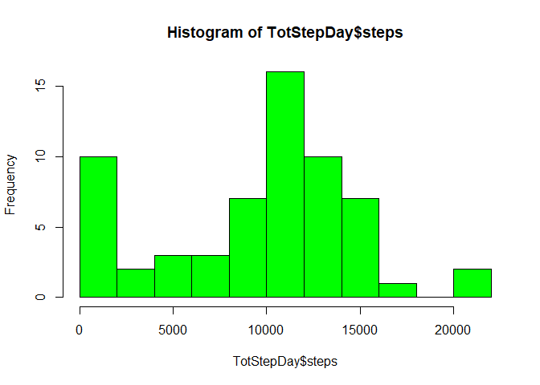
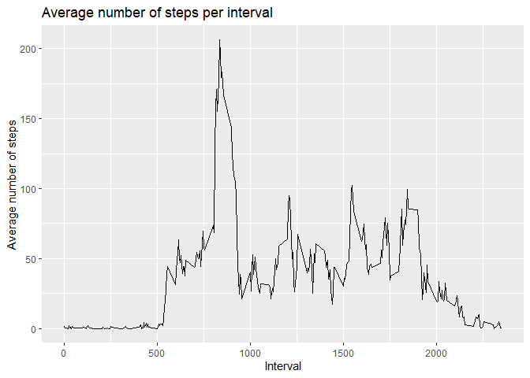
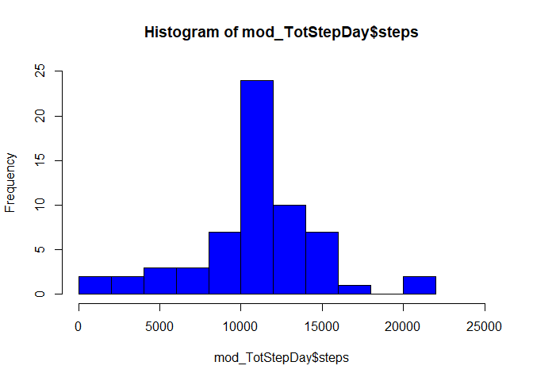
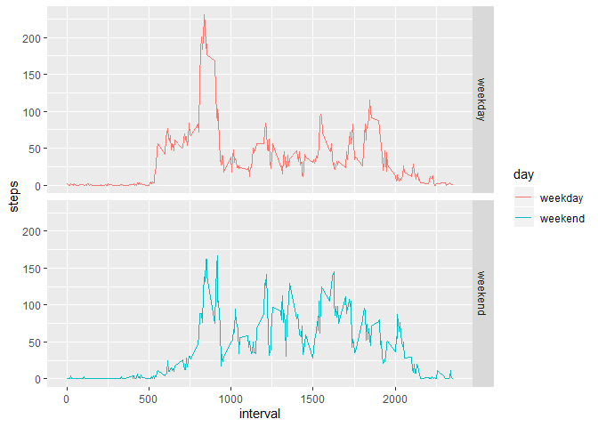

## Loading and preprocessing the data
Assuming you have already saved "activity.csv" from the zip file on this repo into your current working dir. 


```r
#load the data into assigned dat
dat <- read.csv("activity.csv", na.strings = "NA")
#ggplot will be used in few questions below
library(ggplot2)
```

## What is mean total number of steps taken per day?
Here, the missing value "NA" are skipped (na.rm=TRUE)


```r
#group steps w.r.t. date, and ignore missing value. So na.rm=TRUE is assumed here, 
#otherwise, hist() plot is quite different close to x-axis =0
TotStepDay <- aggregate(dat$steps, list(dat$date), FUN=sum, na.rm=TRUE)
#after grouping, the df TotStepDay has Columns of "Group.1" and "x", so reassign the names
names(TotStepDay) <- c("date", "steps")
#plot and save to a PNG file
hist(TotStepDay$steps, breaks=10, col="green")
```

<!-- -->

```r
#output mean and median of the total number of steps taken per day
mean(TotStepDay$steps, na.rm=TRUE)
```

```
## [1] 9354.23
```

```r
median(TotStepDay$steps, na.rm=TRUE)
```

```
## [1] 10395
```

mean() and median() gave you the mean and median of total number of steps per day are 9354.23 and 10395 respectively.

## What is the average daily activity pattern?
Make a time series plot of the 5-minute interval (x-axis) and the average number of steps taken, averaged across all days (y-axis).


```r
IntvalStep <- aggregate(dat$steps, list(dat$interval), FUN=mean, na.rm=TRUE)
names(IntvalStep) <- c("interval", "steps")

library(ggplot2)
ggplot(IntvalStep, aes(interval, steps))+
  geom_line()+xlab("Interval")+ylab("Average number of steps")+
  ggtitle("Average number of steps per interval")
```

<!-- -->

```r
IntvalStep$interval[which.max(IntvalStep$steps)]
```

```
## [1] 835
```

The average maximum number of steps are 206.2 at the interval of 835.

## Imputing missing values

We already know the missing value is coded as "NA". An easy way is to look up summary().
The total number of NA is 2304.


```r
summary(dat)
```

```
##      steps                date          interval     
##  Min.   :  0.00   2012-10-01:  288   Min.   :   0.0  
##  1st Qu.:  0.00   2012-10-02:  288   1st Qu.: 588.8  
##  Median :  0.00   2012-10-03:  288   Median :1177.5  
##  Mean   : 37.38   2012-10-04:  288   Mean   :1177.5  
##  3rd Qu.: 12.00   2012-10-05:  288   3rd Qu.:1766.2  
##  Max.   :806.00   2012-10-06:  288   Max.   :2355.0  
##  NA's   :2304     (Other)   :15840
```

Devise a strategy for filling in all of the missing values in the dataset. Use the mean for that 5-minute interval calculated in the previous question. Create a new dataset ("dat_replaceNA" as below) that is equal to the original dataset but with the missing data filled in.


```r
#reassign the original df to a new one which will be used to modify missing values
dat_replaceNA <- dat
#use ifelse() and match() to find the NA value for steps and replace by mean steps per interval
#df IntvalStep is the same as described in the previous question
dat_replaceNA$steps <- ifelse(is.na(dat_replaceNA$steps), 
       IntvalStep$steps[match(IntvalStep$interval, dat_replaceNA$interval)], dat_replaceNA$steps)
#look up the new df
head(dat_replaceNA)
```

```
##       steps       date interval
## 1 1.7169811 2012-10-01        0
## 2 0.3396226 2012-10-01        5
## 3 0.1320755 2012-10-01       10
## 4 0.1509434 2012-10-01       15
## 5 0.0754717 2012-10-01       20
## 6 2.0943396 2012-10-01       25
```

Make a histogram of the total number of steps taken each day and Calculate and report the mean and median total number of steps taken per day. 

```r
#group total steps per day for this new df by the same method in the second question.
mod_TotStepDay <- aggregate(dat_replaceNA$steps, list(dat_replaceNA$date), FUN=sum)
names(mod_TotStepDay) <- c("date", "steps")
#ploting the histogram figure
hist(mod_TotStepDay$steps, breaks=10, col="blue", xlim=c(0, 25000), ylim=c(0, 25))
```

<!-- -->

```r
mean(mod_TotStepDay$steps, na.rm=TRUE)
```

```
## [1] 10766.19
```

```r
median(mod_TotStepDay$steps, na.rm=TRUE)
```

```
## [1] 10766.19
```

Both mean and median of total number of steps per day for the modified dataset are 10766. Comparing with mean and median of total number of steps per day are 9354.23 and 10395 respectively without imputing missing value, this results are quite different and the high frequency at 0 has gone. The mean value increases since we replace NA with mean steps. So it's very important to impute the missing value especially when its present in the data set can NOT be ignored. For example, there are 2304 NAs out of total 17568 observations, which is over 13% of total data. 

## Are there differences in activity patterns between weekdays and weekends?
Use the dataset with the filled-in missing values for this part. The corresponding codes are the same as previous questions.
Create a new factor variable in the dataset with two levels - "weekday" and "weekend" indicating whether a given date is a weekday or weekend day.


```r
dat_replaceNA$day <- weekdays(as.POSIXct(dat_replaceNA$date))
#use ifelse() to replace Monday-Friday as weekday, and Saturday-Sunday as weekend
weekend <- c("Saturday", "Sunday")
dat_replaceNA$day <- ifelse(dat_replaceNA$day %in% weekend, "weekend", "weekday")
```

Make a panel plot containing a time series plot (i.e. type = "l") of the 5-minute interval (x-axis) and the average number of steps taken, averaged across all weekday days or weekend days (y-axis).

```r
day_step <- aggregate(steps~interval+day, dat_replaceNA, FUN=mean, na.rm=TRUE)

library(ggplot2)
ggplot(day_step, aes(interval, steps, color=day))+geom_line()+facet_grid(day~.)
```

<!-- -->

From this panel plot, it clearly shows there is no peak at interval 835 on weekends compared with weekdays due to the intrisic activity pattern on weekends (no work/commute). So the activity pattern is flatter (more uniform) on weekends.
